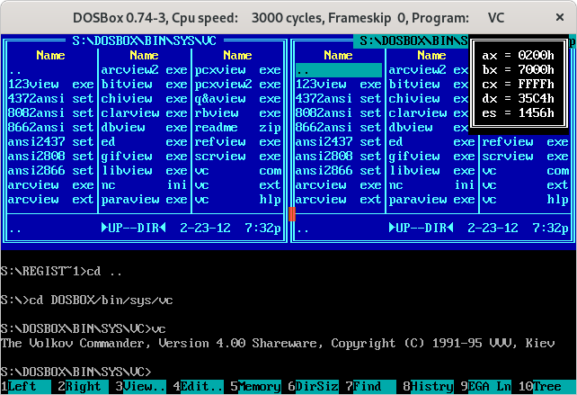

# Показания регистров

Резидентная `DOS`-программа, использующая системное прерывание таймера для вывода состояния регистров.

## Как запустить?

```
> tasm /la register.asm
> tlink /t register.obj
> register.com
```

## Результат выполнения


